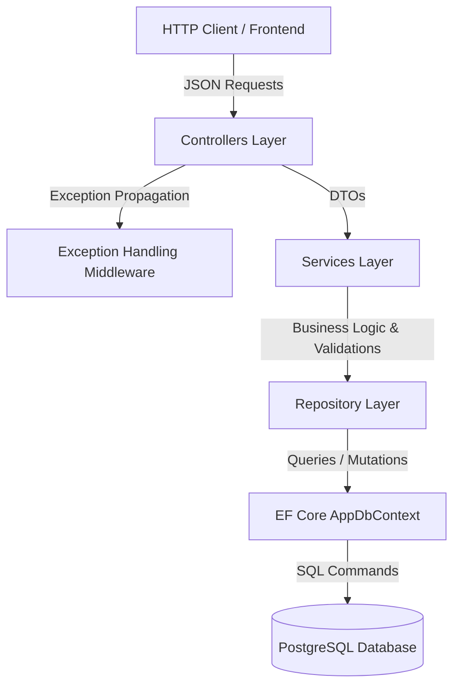
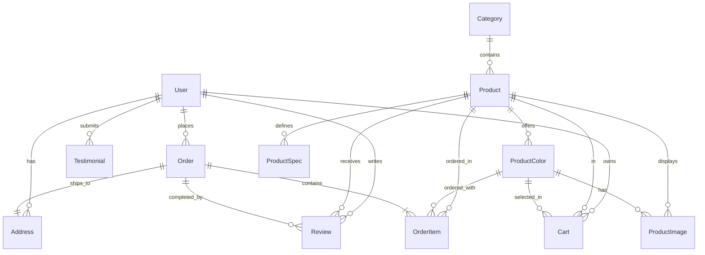

# Cruise3D Backend API Documentation

Welcome to the comprehensive documentation for the **Cruise3D Web API** backend. Cruise3D is a feature-rich, high-performance e-commerce Web API tailored for customizable goods (such as 3D prints, souvenirs, and personalized items). It is built on **.NET 10.0** and powered by **PostgreSQL** using Entity Framework (EF) Core.

---

## 🏗️ Architecture & Core Design Patterns

The Cruise3D backend follows a modern **N-Tier (Layered) Architecture** with a clear separation of concerns. This design guarantees maintainability, scalability, and testability.



### Key Architectural Patterns
1. **Repository Pattern**: Data access logic is isolated in a repository layer (e.g., [ProductRepository](file:///c:/cruise3d-backend/cruise3d/cruise3d/Repositories/ProductRepository.cs)). This abstracts direct EF Core queries, keeps the codebase clean, and makes unit testing services easier by mocking repositories.
2. **Service Layer**: Business workflows, pricing logic, stock validations, and transactional logic are defined in services (e.g., [OrderService](file:///c:/cruise3d-backend/cruise3d/cruise3d/Services/OrderService.cs)). Controllers do not access repositories directly; they delegate to the service layer.
3. **Data Transfer Objects (DTOs)**: Inputs and outputs are strictly shaped using DTOs to hide domain entities, prevent over-posting vulnerabilities, and format API responses cleanly.
4. **Global Exception Handling Middleware**: A custom [ExceptionMiddleware](file:///c:/cruise3d-backend/cruise3d/cruise3d/Middleware/ExceptionMiddleware.cs) catches all unhandled exceptions, logs them, and formats the output into a standardized JSON response.
5. **Standardized API Response**: Every endpoint returns a unified payload format defined in [ApiResponse.cs](file:///c:/cruise3d-backend/cruise3d/cruise3d/Models/DTOs/Common/ApiResponse.cs):
   ```json
   {
     "success": true,
     "message": "Action completed successfully",
     "data": { ... }
   }
   ```
6. **Soft Deletions**: Rather than deleting products permanently, a soft-delete mechanism marks the product as inactive ([IsActive = false](file:///c:/cruise3d-backend/cruise3d/cruise3d/Models/Entities/Product.cs#L25)). This preserves referential integrity for past orders referencing that product.

---

## 📂 Project Directory Structure

```text
cruise3d-backend/
└── cruise3d/
    ├── cruise3d.slnx                     # Visual Studio Solution description
    └── cruise3d/
        ├── cruise3d.API.csproj          # Project configuration & package dependencies
        ├── Program.cs                    # Application entry point, DI, & middleware pipeline
        ├── appsettings.json              # Main configuration file (Db connection, JWT settings)
        ├── Controllers/                  # API Controllers (routing, authorization, request handling)
        ├── Data/                         # EF Core DbContext and database-related configurations
        │   ├── AppDbContext.cs           # EF Core database context
        │   └── Configurations/           # Fluent API entity configs & database constraints
        ├── Helpers/                      # Utility and helper classes (JWT parsing, pagination placeholders)
        ├── Middleware/                   # Custom HTTP pipeline middleware (Exception handling, rate limiting)
        ├── Migrations/                   # EF Core database migrations history
        ├── Models/                       # Domain entities and Data Transfer Objects (DTOs)
        │   ├── Entities/                 # Database representation models
        │   └── DTOs/                     # API Request and Response payload shapes
        ├── Repositories/                 # Database CRUD logic (separating EF Core from services)
        │   └── Interfaces/               # Repository contracts
        └── Services/                     # Business logic, validation rules, orchestration
            └── Interfaces/               # Service contracts
```

---

## 🗄️ Database Schema & Entity Relations

The database represents a relational e-commerce schema optimized for customizable products. Below is the Entity-Relationship (ER) diagram representing the structure:



### Entity Explanations
* **[User](file:///c:/cruise3d-backend/cruise3d/cruise3d/Models/Entities/User.cs)**: Stores user registration data and credentials hashed via BCrypt. Supports roles (`customer` and `admin`).
* **[Address](file:///c:/cruise3d-backend/cruise3d/cruise3d/Models/Entities/Address.cs)**: Standard shipping address format using an Indian Rupee context (`Pincode` instead of Zip).
* **[Product](file:///c:/cruise3d-backend/cruise3d/cruise3d/Models/Entities/Product.cs)**: Represents the items. Supports customizable colors via the `ColorType` attribute (`fixed` or `custom`) and keeps general spec tags.
* **[ProductColor](file:///c:/cruise3d-backend/cruise3d/cruise3d/Models/Entities/ProductColor.cs)**: Lists selectable colors for customizable models. Each color can have its own inventory level override (`StockOverride`).
* **[ProductImage](file:///c:/cruise3d-backend/cruise3d/cruise3d/Models/Entities/ProductImage.cs)**: Product gallery media. Can be associated with a specific color option so selecting a color loads relevant images.
* **[ProductSpec](file:///c:/cruise3d-backend/cruise3d/cruise3d/Models/Entities/ProductSpec.cs)**: Custom metadata tags (e.g., Print Resolution, Infill Ratio, Dimensions) for items.
* **[Cart](file:///c:/cruise3d-backend/cruise3d/cruise3d/Models/Entities/Cart.cs)**: Serves as a shopping cart item. Links a user, a product, and an optional color choice to a specific quantity.
* **[Order](file:///c:/cruise3d-backend/cruise3d/cruise3d/Models/Entities/Order.cs) & [OrderItem](file:///c:/cruise3d-backend/cruise3d/cruise3d/Models/Entities/OrderItem.cs)**: Tracks purchases. Includes price and color snapshots at checkout time to preserve history if prices or products update later.

---

## 🛠️ Key Functionality Implementation Details

### 1. Authentication & Security
* **Password Hashing**: Done via `BCrypt.Net-Next` to ensure secure storing of passwords.
* **JWT Bearer Authentication**: Configured in [Program.cs](file:///c:/cruise3d-backend/cruise3d/cruise3d/Program.cs#L19-L35). Validates the issuer, audience, and signature using a security key defined in configuration files.
* **Claims Access**: Utilizes a helper class [JwtHelper](file:///c:/cruise3d-backend/cruise3d/cruise3d/Helpers/JwtHelper.cs) to extract the logged-in user's `UserId` or `Role` safely from HTTP contexts.

### 2. E-Commerce Order Flow
* **Stock Checks**: Before an order is created, the system checks product stock availability in a transaction. If stock is insufficient, it blocks checkout.
* **Stock Deduction**: Upon successful placement, stock levels are automatically decremented ([OrderService.cs](file:///c:/cruise3d-backend/cruise3d/cruise3d/Services/OrderService.cs#L85)).
* **Flat-rate Shipping**: Configured as a flat rate of `₹60` ([OrderService.cs](file:///c:/cruise3d-backend/cruise3d/cruise3d/Services/OrderService.cs#L14)).
* **Database Level Constraints**: Configured in the `Configurations/` folder, ensuring database columns have constraints:
  * Order status is checked using PostgreSQL constraints and limited to `('pending','confirmed','printing','shipped','delivered','cancelled')` (includes the state `'printing'` for customized items).
  * Quantity check constraints ensure that orders and cart items cannot have values $\le 0$.

### 3. Global Exception Handler
* Standardizes all unhandled server exceptions into user-friendly responses.
* Dynamic Status Code Mapping in [ExceptionMiddleware.cs](file:///c:/cruise3d-backend/cruise3d/cruise3d/Middleware/ExceptionMiddleware.cs#L36):
  * Exceptions containing `"not found"` map to `404 Not Found`.
  * Exceptions containing `"unauthorized"` map to `410 Unauthorized`.
  * Exceptions containing `"already exists"` or `"already registered"` map to `409 Conflict`.
  * Other custom logic defaults to `400 Bad Request`.

---

## 🔌 API Endpoints Reference

### Authentication (`api/auth`)
| Method | Route | Access | Details |
| :--- | :--- | :--- | :--- |
| `POST` | `/api/auth/register` | Public | Register a new user account |
| `POST` | `/api/auth/login` | Public | Log in and receive a JWT Bearer token |
| `GET` | `/api/auth/me` | Authenticated | Fetch active user's details and profile |

### Product Catalog (`api/products`)
| Method | Route | Access | Details |
| :--- | :--- | :--- | :--- |
| `GET` | `/api/products` | Public | Browse products with search, min/max price, category filters, and pagination |
| `GET` | `/api/products/featured` | Public | Fetch featured items for the home page |
| `GET` | `/api/products/bestsellers` | Public | Fetch bestselling items |
| `GET` | `/api/products/{id}` | Public | Get detailed info for a product, including specs, colors, images, and ratings |
| `POST` | `/api/products` | Admin Only | Create a new product (validates SKU uniqueness) |
| `PUT` | `/api/products/{id}` | Admin Only | Update an existing product's info |
| `DELETE`| `/api/products/{id}` | Admin Only | Soft-delete a product (marks `IsActive = false`) |

### Shopping Cart (`api/cart`)
| Method | Route | Access | Details |
| :--- | :--- | :--- | :--- |
| `GET` | `/api/cart` | Customer Only | Get items currently in the user's cart |
| `POST` | `/api/cart` | Customer Only | Add a product (with color selection) to the cart |
| `PUT` | `/api/cart/{cartId}` | Customer Only | Update the quantity of a cart item |
| `DELETE`| `/api/cart/{cartId}` | Customer Only | Remove an item from the cart |
| `DELETE`| `/api/cart` | Customer Only | Clear all items from the cart |

### Orders & Checkout (`api/orders`)
| Method | Route | Access | Details |
| :--- | :--- | :--- | :--- |
| `POST` | `/api/orders` | Customer Only | Place a new order from cart items (decrements stock, clears cart) |
| `GET` | `/api/orders/my` | Customer Only | View the logged-in customer's order history |
| `GET` | `/api/orders/my/{orderId}` | Customer Only | View detailed order tracking and item summary |
| `GET` | `/api/orders` | Admin Only | List all database orders with optional status filters |
| `PUT` | `/api/orders/{orderId}/status`| Admin Only | Update order status (`pending`, `confirmed`, `printing`, `shipped`, etc.) |

### Category Management (`api/categories`)
| Method | Route | Access | Details |
| :--- | :--- | :--- | :--- |
| `GET` | `/api/categories` | Public | Fetch all available categories |
| `POST` | `/api/categories` | Admin Only | Add a new category |
| `PUT` | `/api/categories/{id}` | Admin Only | Update category name, slug, or sort order |
| `DELETE`| `/api/categories/{id}` | Admin Only | Delete category (re-assigns category products to null) |

### Admin Operations (`api/admin`)
| Method | Route | Access | Details |
| :--- | :--- | :--- | :--- |
| `GET` | `/api/admin/dashboard` | Admin Only | Fetch business statistics (total users, total revenue, low stock alerts) |

### Stubs / Placeholders (Under Development)
* **`api/Testimonials`**: Stub endpoints for testimonial submissions and approvals.
* **`api/Newsletter`**: Placeholders for newsletter subscriptions and subscription confirmation.

---

## 🛠️ Technology Stack
* **Runtime**: .NET 10.0 Web API
* **Database Driver**: Npgsql Entity Framework Core Provider (PostgreSQL)
* **Authentication**: Microsoft JWT Bearer Tokens & BCrypt
* **Documentation**: OpenAPI Specification (via Swagger / Swashbuckle)
* **Code Standard**: C# 14 file-scoped namespaces, global imports, nullable reference types, and primary constructors where applicable.
